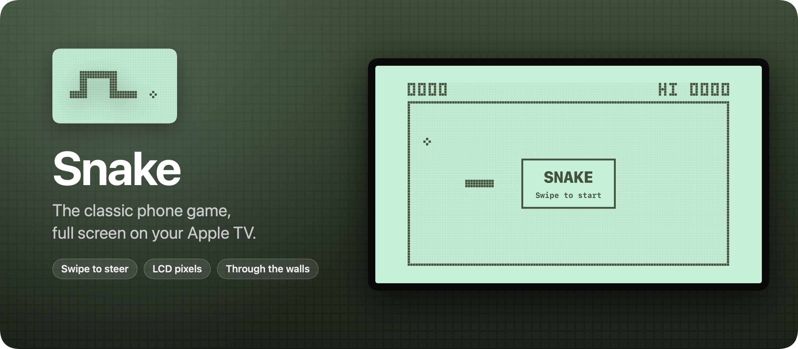
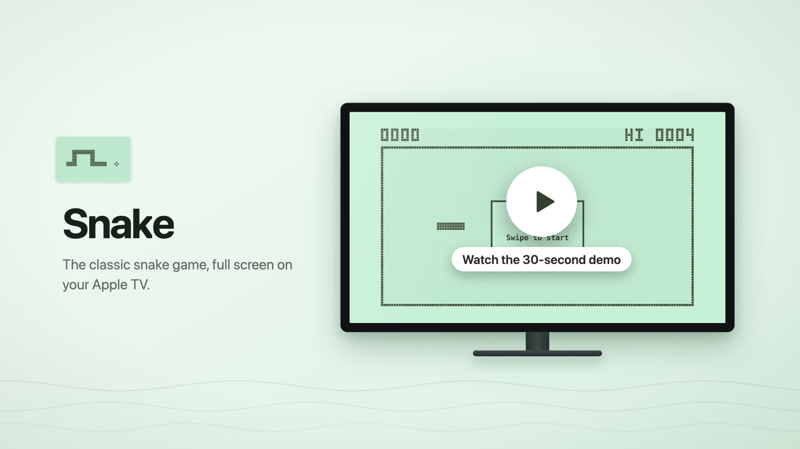
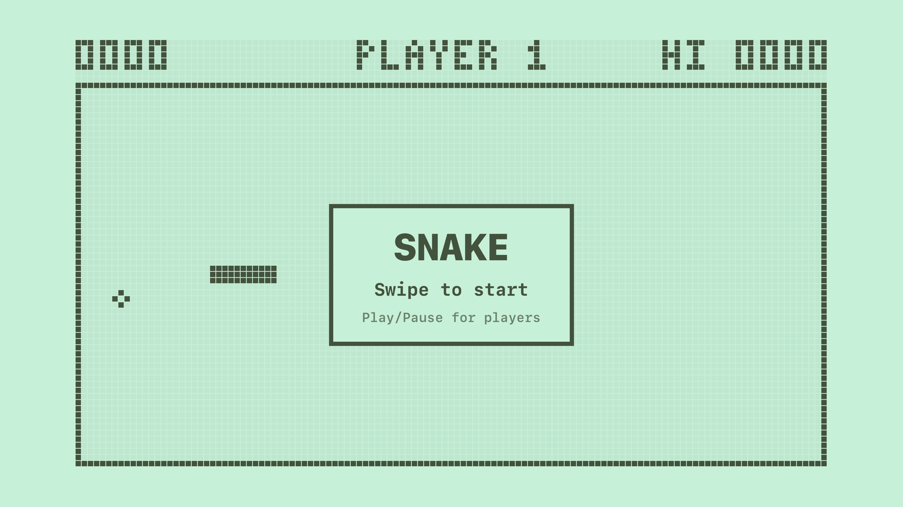

Snake is the classic snake game from old mobile phones, rebuilt for the Apple TV. It fills the TV with a pale green LCD screen, and you steer the snake by swiping on the Siri Remote.

Everything on screen is made of chunky dot-matrix pixels, the score included. The snake goes through the walls and comes out the other side, so the only way to lose is to bite yourself.

Read the announcement and watch the 30-second demo on my blog: [I built Snake, the classic phone game for the Apple TV](https://flaviocopes.com/snake/).

[](https://flaviocopes.com/snake/)

## Features

- Full screen, on a 30 by 15 board drawn as LCD pixels
- The snake speeds up a little with every piece of food, up to two and a half times its starting speed
- Turns queue up, so two quick swipes make a U-turn
- The snake blinks when it dies
- Your best score is saved, and shows top right as `HI`
- The game pauses when you leave the app



## How to play

- **Swipe** up, down, left or right to turn. On the newer Siri Remote, clicking the edges of the clickpad works too. Your first swipe starts the game.
- **Click** to start, to continue after a pause, and for a new game after game over.
- **Play/Pause** pauses and resumes.
- **Back**, or **Menu** on older remotes, pauses a running game. When the game isn't running, it goes back to the Home screen.

## Install it on your Apple TV

The Apple TV can't install apps from a download, and Snake isn't on the App Store. You install it from Xcode on your own Apple TV, which takes a few minutes the first time:

1. Put the Mac and the Apple TV on the same network. On the Apple TV, open **Settings → Remotes and Devices → Remote App and Devices**.
2. In Xcode, open **Window → Devices and Simulators**, click **Pair** next to your Apple TV, and type the code it shows.
3. Open `Snake.xcodeproj`, choose the `Snake` scheme and your Apple TV, and set your own team under **Signing & Capabilities**.
4. Press `⌘R`.

It needs tvOS 18 or later and an Apple Developer account. With a paid account, the app keeps working for a year. After that, run it from Xcode again.

To try it without an Apple TV, pick an Apple TV simulator in step 3. The arrow keys steer and `Return` clicks.

## Development

You need macOS 15 or later and Xcode 26.

The Xcode project is generated from `project.yml` with [XcodeGen](https://github.com/yonaskolb/XcodeGen). After editing `project.yml`, regenerate it:

```sh
xcodegen generate
```

The tests cover the game rules, and a UI test plays with a simulated remote. Both run in a simulator that boots in the background:

```sh
xcodebuild test -project Snake.xcodeproj -scheme Snake -destination 'platform=tvOS Simulator,name=Apple TV 4K (3rd generation)'
```

The icon and the Top Shelf images are drawn in code. Edit `scripts/render-icon.swift`, then write a new `Snake/Assets.xcassets`:

```sh
swift scripts/render-icon.swift
```

The screenshot comes from the app running in the simulator, and the banner uses the icon and the screenshot:

```sh
scripts/screenshot.sh
swift scripts/render-banner.swift
```

Working with an AI coding agent? Point it at [AGENTS.md](AGENTS.md). It has the commands and the rules to follow.

## How it works

The rules live in `SnakeGame.swift`, a plain struct with no UI. Every tick, the head moves one cell and the tail follows, unless the snake just ate. The tail moves out of the way first, so the snake can chase its own tail without dying. Swipes go into a short queue, and each tick takes one, which is why two quick swipes turn the snake around.

The screen is one SwiftUI `Canvas` that draws LCD pixels. Each board cell is 4 pixels wide: the snake is a chain of 3×3 blocks, joined by a line of pixels where two segments touch. The faint grid of unlit pixels sits in its own canvas, so it's drawn once instead of on every tick. The remote reaches the game through SwiftUI's tvOS commands: `onMoveCommand` for swipes, `onTapGesture` for clicks, `onPlayPauseCommand` and `onExitCommand`.

## Legal

Snake is an independent project. It isn't affiliated with, endorsed by or sponsored by Nokia or Apple. Every pixel is drawn in code, and there are no graphics, sounds or fonts from other games in it.

Apple, Apple TV, Siri and tvOS are trademarks of Apple Inc., registered in the U.S. and other countries and regions.

## License

[MIT](LICENSE)
